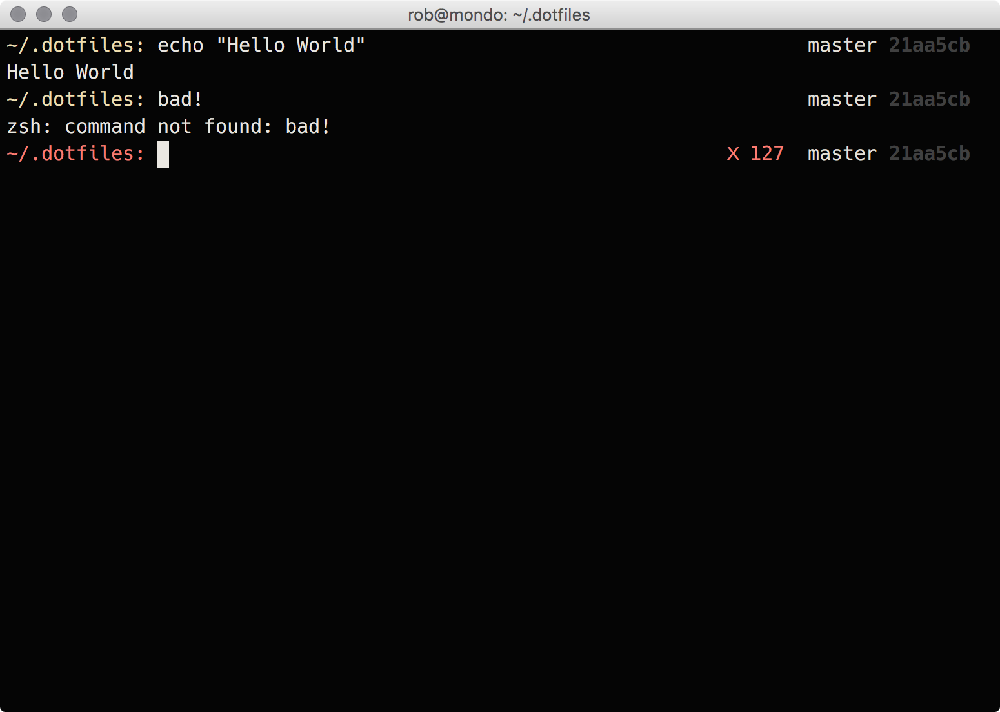
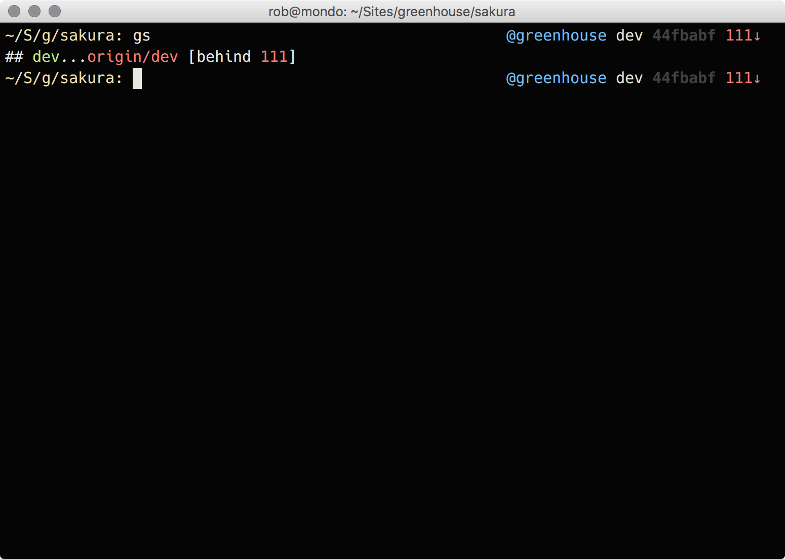
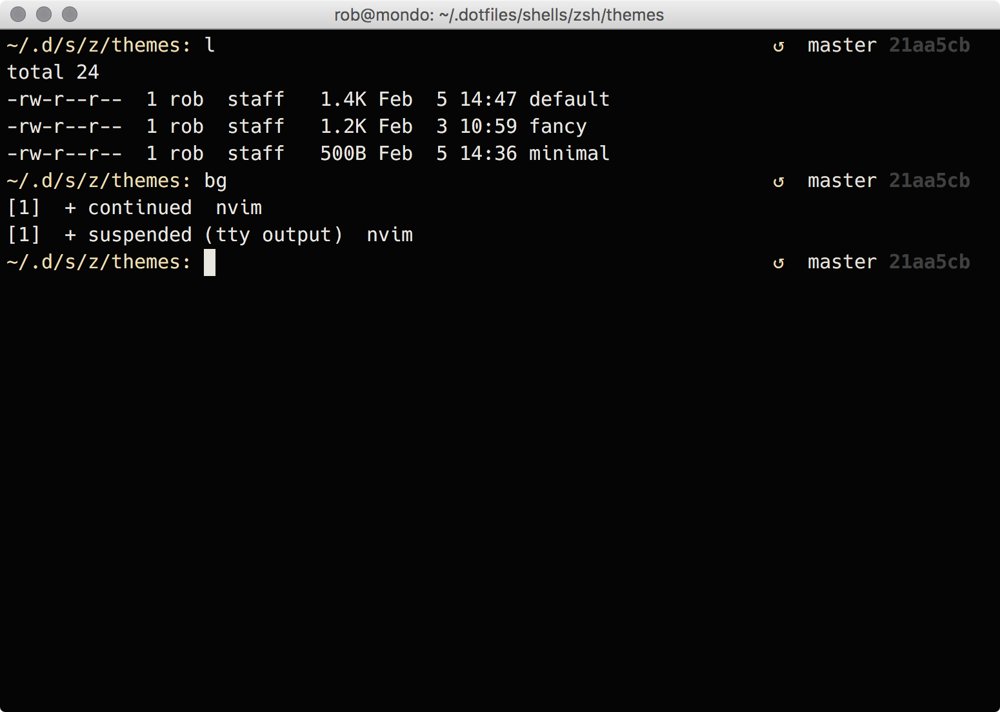

# My Dotfiles.

This is a compilation of my env scripts and config along with pieces from other people which I thought were awesome. It may have limited use in bash as well, though I haven't tried in a long time.

Heres how it looks when using ZSH:

## Install

clone this repo somewhere `git clone https://github.com/robhurring/dotfiles.git` (i use ~/.dotfiles)

*note:* The installers are safe and will ask before overwriting any existing files.

### ZSH Install

1. cd ~/.dotfiles (or wherever repo lives)
2. `make install` to bootstrap all necessary dependencies.
3. `make fonts` to install any fonts (optional)
4. `cp ~/.dotfiles/example/zshrc ~/.zshrc`
  1. modify the example zshrc paths for `DOTFILES`
  2. add any customizations below the init line

### Bash Install

1. cd ~/.dotfiles (or wherever repo lives)
2. `rake bash` to link zsh env files
3. `cp ~/.dotfiles/example/bashrc ~/.bashrc`
  1. modify the example bashrc paths for `DOTFILES`
  2. add any customizations below the init line

### vim Install

This has been moved to [https://github.com/robhurring/dotvim](https://github.com/robhurring/dotvim) to keep it separate.

### Some ZSH Screenshots

Theres a few "themes" as well. Set the `export ZSH_THEME=default` in your `~/.zshrc` to one of the [themes](shells/zsh/themes), or customize your own by setting an absolute path.

###### Error Status

###### Git Stauts

###### Background Jobs

## Customizing Bash

**Note: This is old and I have no idea if this will even work well anymore**

Edit ~/.bashrc before the init line to set the colors. You can also edit the PS1 color by editing the function `__before_ps1()`
and changing `PROMPT_COLOR="\e[33;1m"` to any color you want. There is also an `ERROR_COLOR` too which is red by default.

## Truecolor

Refer to [TrueColor gist](https://gist.github.com/XVilka/8346728).

1. For tmux, [check this pull-request comments](https://gist.github.com/zchee/9f6f2ca17acf49e04088#gistcomment-1575548)
1. For iTerm, use nightly's
1. For vim, compile with `+termguicolors`. Not currently working within tmux
