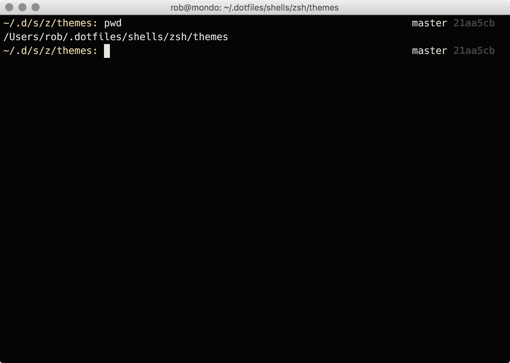

# My Dotfiles.

This is a compilation of my env scripts and config along with pieces from other people which I thought were awesome. It may have limited use in bash as well, though I haven't tried in a long time.

Heres how it looks when using ZSH:

## Install

clone this repo somewhere `git clone https://github.com/robhurring/dotfiles.git` (i use ~/.dotfiles)

*note:* The installers are safe and will ask before overwriting any existing files.

### ZSH Install

1. cd ~/.dotfiles (or wherever repo lives)
1. `make install` to bootstrap all necessary dependencies.
1. `make mac` to bootstrap macos.

### vim Install

This has been moved to [https://github.com/robhurring/dotvim](https://github.com/robhurring/dotvim) to keep it separate.

### Some ZSH Screenshots

Theres a few "themes" as well. Set the `export ZSH_THEME=default` in your `~/.zshrc` to one of the [themes](shells/zsh/themes), or customize your own by setting an absolute path.

## Truecolor

Refer to [TrueColor gist](https://gist.github.com/XVilka/8346728).

1. For tmux, [check this pull-request comments](https://gist.github.com/zchee/9f6f2ca17acf49e04088#gistcomment-1575548)
1. For iTerm, use nightly's
1. For vim, compile with `+termguicolors`. Not currently working within tmux
